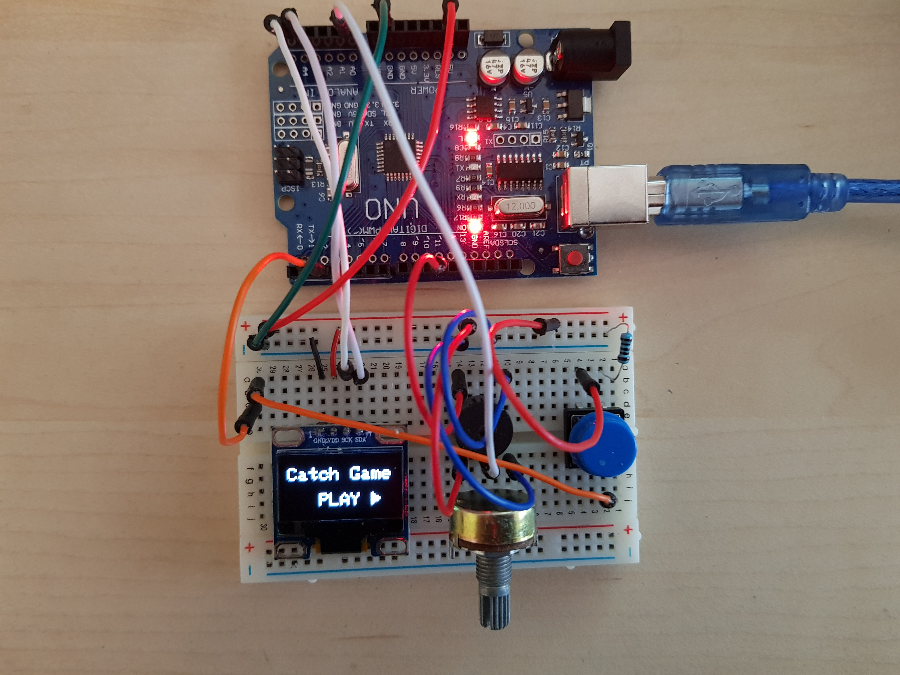

# Arduino CatchGame
Play the classic game of 'catching-falling-objects-with-a-cursor-game' on an Arduino Uno.

The goal of the game is to catch falling objects and reach a high-score. Missing an object will end the game. The game also features several power-ups and power-downs.

The game was created for AAU Imperative Programming Exam (Imperative Programming (IMPR) (EIT1, ITC1, ST1) - AAL E18 [E18-27624]) which i passed with flying colors.

## Hardware requirements
* Arduino
* Potentiometer
* Button
* SSD1306-based OLED-screen
* Piezo speaker

## Library requirements
This project requieres two libraries:

[Adafruit_GFX.h](https://github.com/adafruit/Adafruit-GFX-Library)

[Adafruit_SSD1306](https://github.com/adafruit/Adafruit_SSD1306)

## Image of setup
